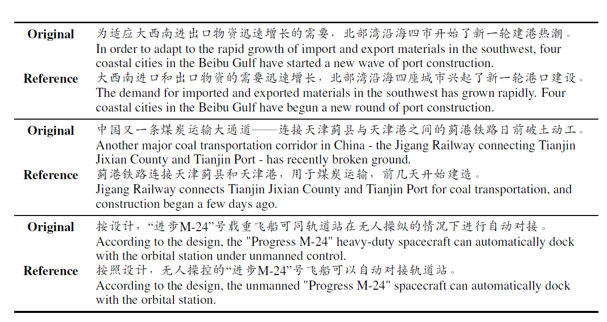
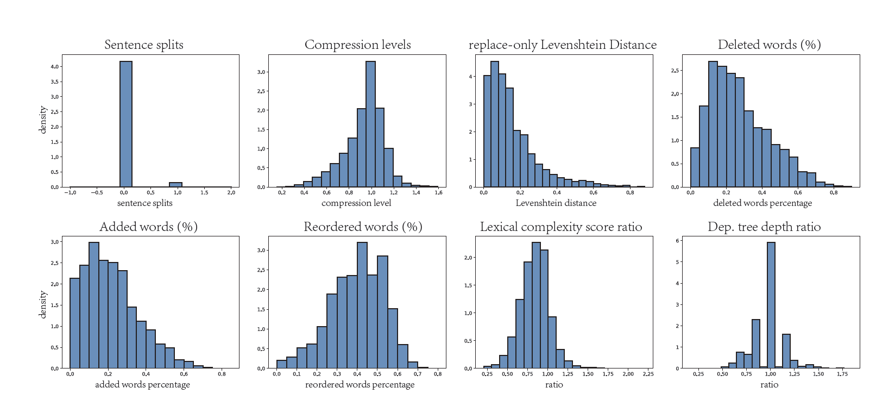
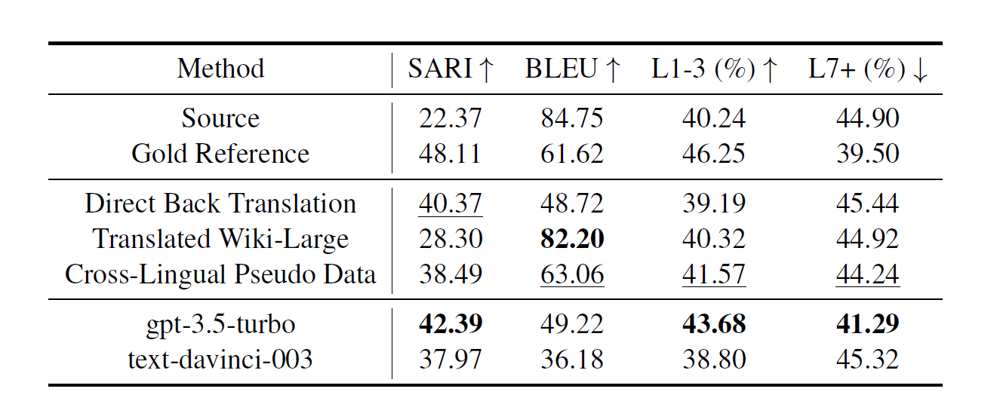
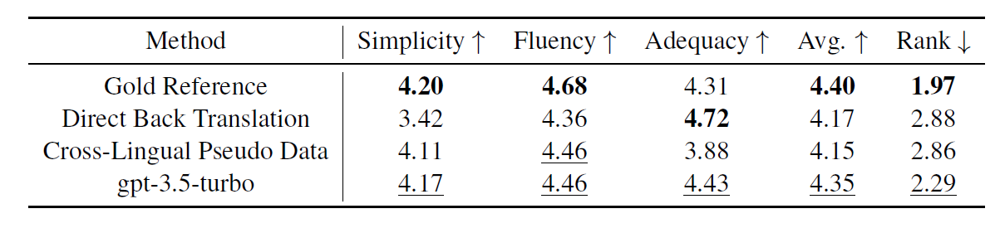

# MCTS: A Multi-Reference Chinese Text Simplification Dataset

## 简介

文本简化任务是自然语言处理领域的基础任务之一，旨在通过改写使句子更容易理解。文本简化可以助力分级阅读、机器翻译等研究，并帮助语言学习者理解复杂文本。目前，关于中文文本简化的研究较少，缺乏通用的评估数据是重要原因之一。为此，我组构建了多参考中文文本简化数据集MCTS（Multi-Reference Chinese Text Simplification Dataset）。该数据集是迄今为止中文文本简化任务上规模最大、参考最多的评估数据集，包括723条从新闻语料中挑选的复杂结构句子，每一句分别包含多条人工简化后的句子。这是我们探索中文文本简化的一项基础性工作，期望能为今后的研究提供参考。

论文地址：[https://arxiv.org/abs/2306.02796](< https://arxiv.org/abs/2306.02796 >)

数据示例：


### 数据规模

MCTS数据集是中文文本简化任务上规模最大、参考最多的**评估**数据集，包括 723 条从新华社等新闻语料中挑选的复杂结构句，每个句子分别包含 5 条人工简化后的句子。通过这项基础性工作，我们希望能建立对中文文本简化的基本认识，为今后的研究提供参考。

### 数据格式

所有文件均为纯文本格式。在文件中，每行是一个文本样本。

文件的内容以命名方式区分。文件的名称由三部分组成：前缀、中缀和后缀。命名格式为：

```
前缀.中缀.后缀（.num）
```

所有文件均以 ``mcts.`` 为前缀。中缀为 ``test.`` 的文件是测试集，中缀为 ``dev.`` 的文件是开发集。

后缀为 ``.orig`` 的文件是未经简化的源语句文件。由标注员简化的5条参考句后缀为 ``simp`` ，后接序号。对于拥有相同中缀的源语句文件和参考句文件，其中句子是按行一一对应的。

### 评估方式

我们采用EASSE提供的自动化评估指标SARI、BLEU，以及Kong等人在论文[*Multitasking framework for unsupervised simple definition generation*](https://arxiv.org/abs/2203.12926) 中提供的HSK-Level评估方式。

*注：若您使用[EASSE](https://github.com/feralvam/easse)软件包进行评估，您应该先对所有测试数据执行分词。*

用于评估HSK-Level的python脚本放在 ``script`` 文件夹下。若想评估测试集源语句文件 ``mcts.test.orig`` 的HSK-Level，使用以下指令：

```sh
python script/HSK_evaluate.py dataset/mcts.test.orig
```

## 文本特征分析

我们计算了简化示例的 8 种文本特征。以下为文本特征的统计图。（详细数据见论文）



## 相关实验

我们对多种基线方法进行了比较，这些方法包括：

- **ChatGPT生成**（gpt-3.5-turbo, text-davinci-003）：使用turbo和davinci-003模型的测试结果；
- **直接反向翻译**（Direct Back Translation）：谷歌翻译进行反向翻译的生成结果；
- **翻译Wiki-Large**（Translated Wiki-Large）：使用翻译的Wiki-Large数据集训练的BART-base文本简化模型生成的测试结果；
- **跨语言伪数据**（Cross-Lingual Pseudo Data）： 用伪数据训练的BART-Base模型生成的测试结果。

我们采用EASSE工具包提供的自动化评估指标 SARI、BLEU，以及 Kong 等人在论文 [*Multitasking Framework for Unsupervised Simple Definition Generation*](https://arxiv.org/abs/2203.12926) 提出的 HSK-Level 评估方式。结果如下表：



对其中表现较好的几种代表性方法，我们聘请具有语言学背景的标注员，从流利性、语义完整性和简单性三个方面，进行了人工评估。评估结果如下：
 

MCTS数据集中的人工简化参考（Gold Reference）在人工评估中获得了最好的平均分数和排名，明显优于其他简化系统的输出结果。

## 作者

如果您有任何问题，或对我们的相关研究感兴趣，欢迎联系我们！

崇瑞宁：（chongruining@outlook.com）

鲁鹿鸣：（lulm410402@foxmail.com）

欢迎关注[**BLCU-ICALL研究组**](< https://blcuicall.org >)的主页和最新动态！
 
## 引用

如果使用了MCTS数据集，请您引用：
```
@misc{chong2023mcts,
      title={MCTS: A Multi-Reference Chinese Text Simplification Dataset}, 
      author={Ruining Chong and Luming Lu and Liner Yang and Jinran Nie and Shuhan Zhou and Yaoxin Li and Erhong Yang},
      year={2023},
      eprint={2306.02796},
      archivePrefix={arXiv},
      primaryClass={cs.CL}
}

@misc{kong-acl-2022-simpdefiner,
      title={Multitasking Framework for Unsupversied Simple Definition Generation}, 
      author={Cunliang Kong and Yun Chen and Hengyuan Zhang and Liner Yang and Erhong Yang},
      booktitle={Proceedings of the 60th Annual Meeting of the Association for Computational Linguistics},     
      year={2022}
}
```

